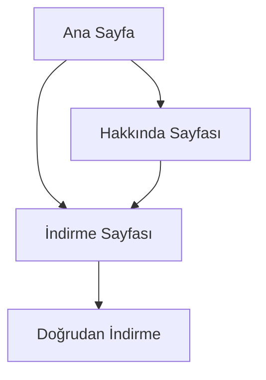

## 1. Product Overview
Inner Evil, Resident Evil'den ilham alınarak geliştirilmiş retro temalı bir korku oyunudur. Bu web sitesi, oyunun tanıtımını yapmak ve indirme bağlantısı sunmak için oluşturulacaktır.

Hedef kitle, retro korku oyunları seven oyuncular ve Resident Evil tarzı oyunlara ilgi duyan kullanıcılardır. Site, oyunun atmosferini yansıtarak potansiyel oyuncuları etkilemeyi ve indirme işlemini kolaylaştırmayı amaçlar.

## 2. Core Features

### 2.1 User Roles
Bu tanıtım sitesi için kullanıcı rol ayrımı gerekli değildir. Tüm ziyaretçiler aynı içeriği görüntüleyebilir ve indirme işlemini gerçekleştirebilir.

### 2.2 Feature Module
Inner Evil tanıtım sitesi aşağıdaki temel sayfalardan oluşacaktır:

1. **Ana Sayfa**: Oyunun tanıtım videosu, görselleri, kısa açıklaması ve indirme butonu
2. **Hakkında Sayfası**: Oyunun hikayesi, özellikleri ve geliştirme süreci hakkında detaylı bilgi
3. **İndirme Sayfası**: Oyunun indirme bağlantıları, sistem gereksinimleri ve kurulum talimatları

### 2.3 Page Details
| Page Name | Module Name | Feature description |
|-----------|-------------|---------------------|
| Ana Sayfa | Hero Section | Retro korku temalı başlık, oyun logosu ve atmosferik arka plan görseli |
| Ana Sayfa | Tanıtım Videosu | Oynatılabilir tanıtım videosu, Resident Evil tarzı korku unsurları |
| Ana Sayfa | Hızlı İndirme | Windows, Mac ve Linux için doğrudan indirme butonları |
| Ana Sayfa | Ekran Görüntüleri | Retro filtreli oyun görselleri, grid düzeninde sergileme |
| Ana Sayfa | Kısa Tanıtım | Oyunun özelliklerini vurgulayan 3-4 maddelik tanıtım metni |
| Hakkında Sayfası | Hikaye Bölümü | Oyunun korku hikayesi ve arka planı hakkında detaylı anlatım |
| Hakkında Sayfası | Oyun Mekanikleri | Retro kontroller, zorluk seviyeleri ve oynanış özellikleri |
| Hakkında Sayfası | Geliştirici Notları | Oyunun geliştirme süreci ve Resident Evil'den ilham alınan unsurlar |
| İndirme Sayfası | Platform Seçimi | Windows, Mac, Linux işletim sistemi seçenekleri |
| İndirme Sayfası | Sistem Gereksinimleri | Minimum ve önerilen sistem gereksinimleri tablosu |
| İndirme Sayfası | Kurulum Talimatları | Adım adım kurulum rehberi ve sıkça sorulan sorular |

## 3. Core Process
Ziyaretçi ana sayfaya geldiğinde önce oyunun atmosferik tanıtım videosunu ve görsellerini görür. Ardından "İndir" butonuna tıklayarak indirme sayfasına yönlendirilir. İndirme sayfasında işletim sistemini seçer ve doğrudan indirme bağlantısına ulaşır. Tüm sayfalarda üst navigasyon çubuğu sayesinde kolayca gezinim sağlanabilir.

## 4. User Interface Design

### 4.1 Design Style
- **Birincil Renk**: Koyu kırmızı (#8B0000) ve siyah (#000000)
- **İkincil Renk**: Soluk yeşil (#90EE90) ve gri (#808080)
- **Buton Stili**: Retro pixel tarzı, 3D efektli, hover'da kırmızı parıltı
- **Font**: Vintage korku tarzı, Courier New veya benzeri monospace font
- **Düzen**: Karanlık tema, grid tabanlı, Resident Evil tarzı sabit genişlik
- **İkonlar**: Retro pixel ikonlar, korku temalı emoji ve semboller

### 4.2 Page Design Overview
| Page Name | Module Name | UI Elements |
|-----------|-------------|-------------|
| Ana Sayfa | Hero Section | Tam ekran korku arka planı, büyük oyun logosu, titrek yazı efekti |
| Ana Sayfa | Video Player | Retro TV çerçevesinde gömülü video, scanline efekti |
| Ana Sayfa | İndirme Butonu | Pixel tarzı büyük buton, hover'da kan efekti animasyonu |
| Ana Sayfa | Görseller | Polaroid çerçeveli ekran görüntüleri, hover'da büyüme efekti |
| Hakkında Sayfası | İçerik | Koyu arka plan, yeşil monospace yazı, tipwriter efekti |
| İndirme Sayfası | Platformlar | Retro radyo butonları, seçili platformda vurgulama |

### 4.3 Responsiveness
Site desktop-first yaklaşımla tasarlanacak, ancak tablet ve mobil cihazlarda da kullanılabilir olacaktır. Retro tema korunurken, mobil cihazlarda dokunmatik optimizasyonu sağlanacaktır.