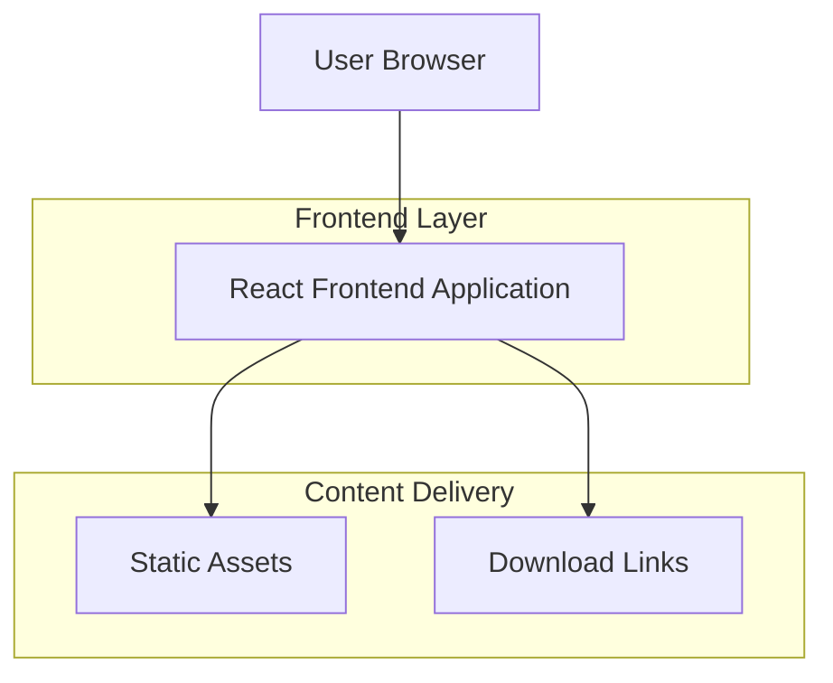

## 1. Architecture design

## 2. Technology Description
- Frontend: React@18 + tailwindcss@3 + vite
- Initialization Tool: vite-init
- Backend: None (Static site)
- Hosting: Static file hosting (Netlify/Vercel/GitHub Pages)

## 3. Route definitions
| Route | Purpose |
|-------|---------|
| / | Ana sayfa, oyun tanıtımı ve hızlı indirme |
| /about | Hakkında sayfası, oyun hikayesi ve özellikleri |
| /download | İndirme sayfası, platform seçenekleri ve sistem gereksinimleri |

## 4. API definitions
Bu proje statik bir tanıtım sitesi olduğu için API tanımlaması gerektirmez. Tüm içerik önceden derlenmiş statik dosyalar olarak sunulacaktır.

## 5. Server architecture diagram
Sunucu katmanı bulunmadığı için mimari diyagram uygulanmaz. Tüm içerik CDN üzerinden statik olarak dağıtılacaktır.

## 6. Data model
Veritabanı kullanılmayacağı için veri modeli tanımlaması yapılmayacaktır. Tüm içerik statik dosyalar ve yapılandırma dosyaları aracılığıyla yönetilecektir.